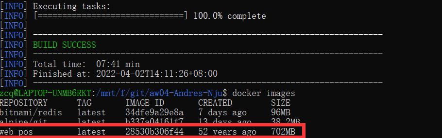
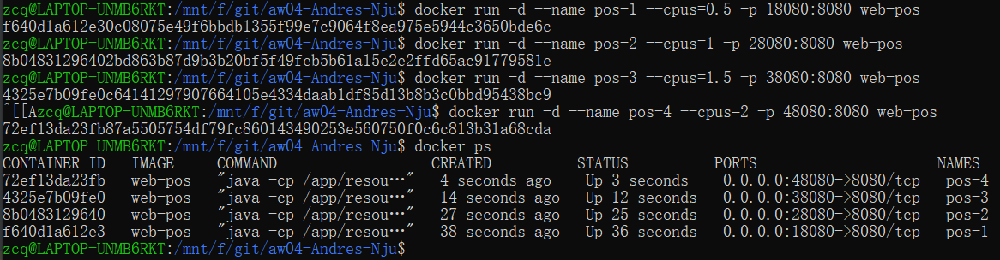
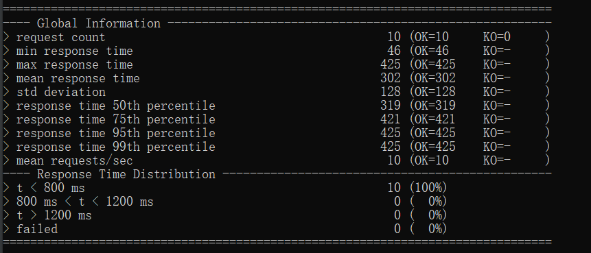
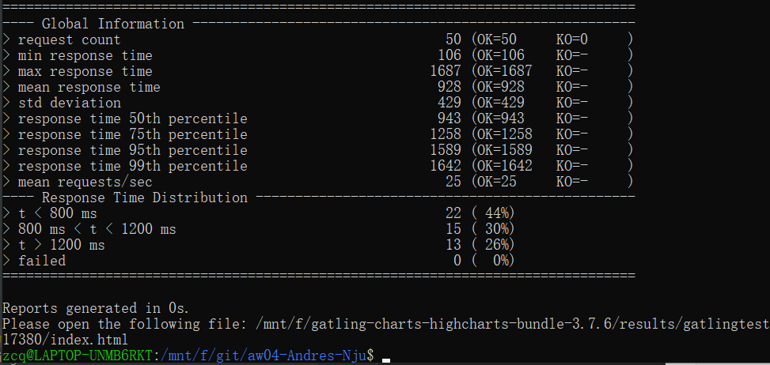
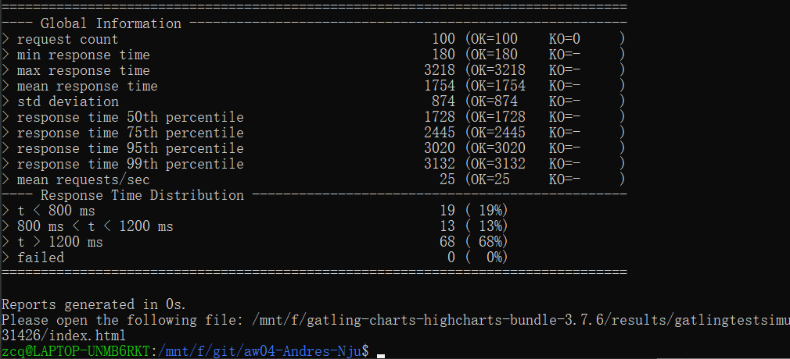
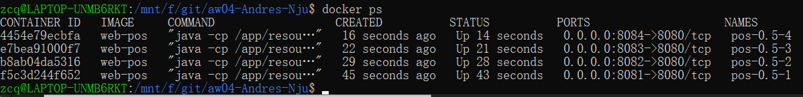
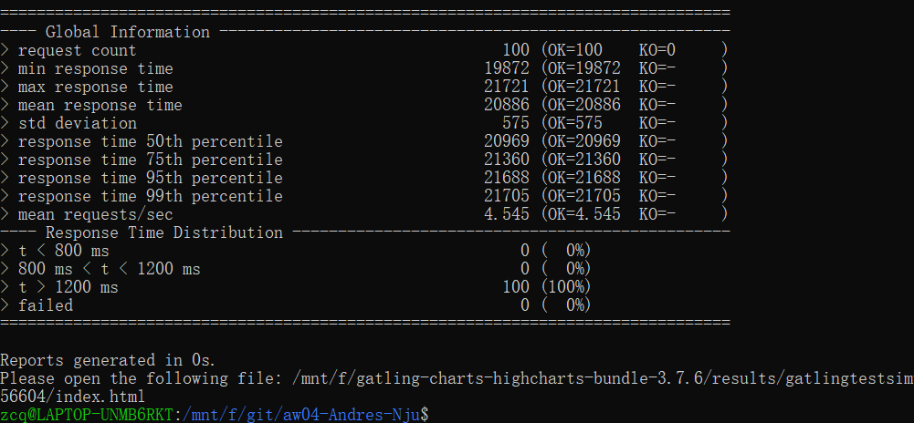
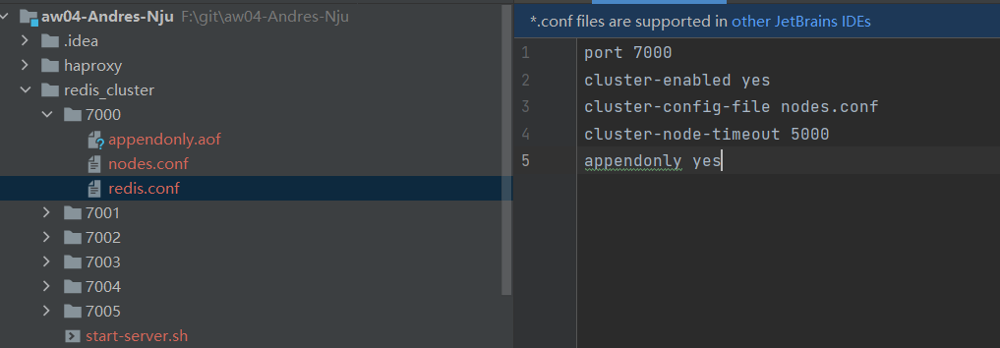
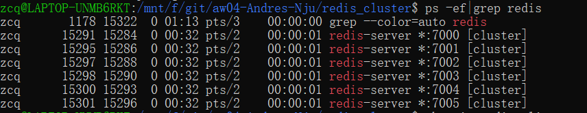
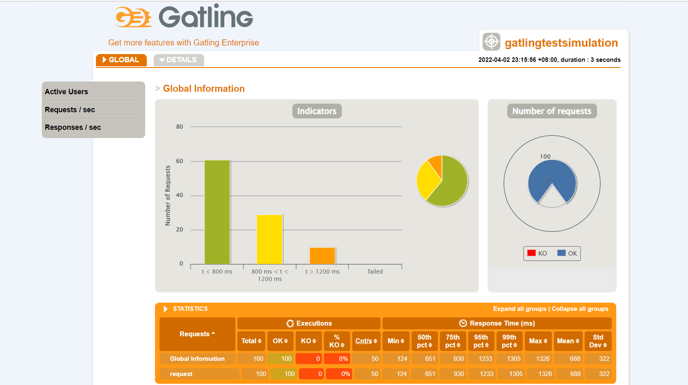

# WebPOS

The demo shows a web POS system , which replaces the in-memory product db in aw03 with a one backed by 京东.


To run

```shell
mvn clean spring-boot:run
```

Currently, it creates a new session for each user and the session data is stored in an in-memory h2 db. 
And it also fetches a product list from jd.com every time a session begins.

1. Build a docker image for this application and performance a load testing against it.
2. Make this system horizontally scalable by using haproxy and performance a load testing against it.
3. Take care of the **cache missing** problem (you may cache the products from jd.com) and **session sharing** problem (you may use a standalone mysql db or a redis cluster). Performance load testings.

Here's the report as below:


首先对源代码进行了一些修改（根据作业3中实现的一些按钮跳转）

## Task 1 

gatling测试脚本：

```scala
package gatlingtest

import io.gatling.core.Predef._
import io.gatling.http.Predef._
import scala.concurrent.duration._

class GatlingTestSimulation extends Simulation {

  val httpProtocol = http
    .baseUrl("http://localhost:18080")
    .acceptHeader("text/html,application/xhtml+xml,application/xml;q=0.9,*/*;q=0.8")
    .doNotTrackHeader("1")
    .acceptLanguageHeader("en-US,en;q=0.5")
    .acceptEncodingHeader("gzip, deflate")
    .userAgentHeader("Mozilla/5.0 (Macintosh; Intel Mac OS X 10.8; rv:16.0) Gecko/20100101 Firefox/16.0")

  val scn = scenario("Testing WebPos")
    .exec(
      http("request")
        .get("/add?pid=13284888")
    )

  setUp(scn.inject(atOnceUsers(10)).protocols(httpProtocol))
}
```

先访问add一个商品

### 垂直扩展测试：

使用jib工具打包项目



生成4个不同的docker容器，分别占用0.5、1、1.5、2个cpu进行处理



执行压力测试：

- 对0.5个cpu的：

  

1/1.5/2个cpu的结果就不截图了，下面用表格形式列出关键信息：

- 10个并发请求：

| cpu                   | 0.5  | 1.0  | 1.5  | 2.0  |
| --------------------- | ---- | ---- | ---- | ---- |
| min response time(ms) | 46   | 55   | 35   | 21   |
| max response time     | 425  | 183  | 151  | 112  |
| mean response time    | 302  | 114  | 92   | 81   |

- 50个并发请求：

  0.5个cpu时的结果截图：

  

| cpu                   | 0.5  | 1.0  | 1.5  | 2.0  |
| --------------------- | ---- | ---- | ---- | ---- |
| min response time(ms) | 106  | 221  | 139  | 71   |
| max response time     | 1687 | 1116 | 717  | 511  |
| mean response time    | 928  | 716  | 418  | 317  |

- 100个并发请求：

  0.5个cpu的结果截图：

  

| cpu                   | 0.5  | 1.0                | 1.5  | 2.0  |
| --------------------- | ---- | ------------------ | ---- | ---- |
| min response time(ms) | 180  | 255(第二次重测175) | 159  | 91   |
| max response time     | 3218 | 3825(2513)         | 1721 | 1210 |
| mean response time    | 1754 | 2483(1504)         | 981  | 692  |

感觉波动一直比较大，特别是cpu=0.5/1的时候，有时候会有很慢（甚至请求全部fail）的情况


## Task 2 水平扩展

项目文件夹下创建`haproxy/haproxy.cfg`文件如下：

```config
defaults
    mode tcp
frontend webpos
    bind *:8080
    default_backend servers
backend servers
    balance roundrobin
    server server1 localhost:8081
    server server2 localhost:8082
    server server3 localhost:8083
    server server4 localhost:8084
```

新建4个容器，均分配0.5个cpu



运行haproxy，分别尝试1/2/3/4个节点处理100个请求，获得以下结果(截图为1个结点的情况，其他个数的结果通过表格呈现，不再赘述)：



| 节点数 | min response time | max response time | mean response time |
| ------ | ----------------- | ----------------- | ------------------ |
| 1      | 1181              | 3653              | 2385               |
| 2      | 611               | 2375              | 1600               |
| 3      | 148               | 1504              | 732                |
| 4      | 81                | 1466              | 714                |


## Task 3 Cache missing

- 先按照作业讲解中添加依赖、修改配置

- 然后为controller添加会话

- 配置redis集群

  

- 运行脚本创建集群

  （redis-cli版本过低，无法使用--cluster参数，更新一直失败，所以直接用`ps -ef|grep redis`指令查看

  

- 使用之前的压力测试脚本测试：

  
  
- 之后一直报500访问错，没办法具体分析

